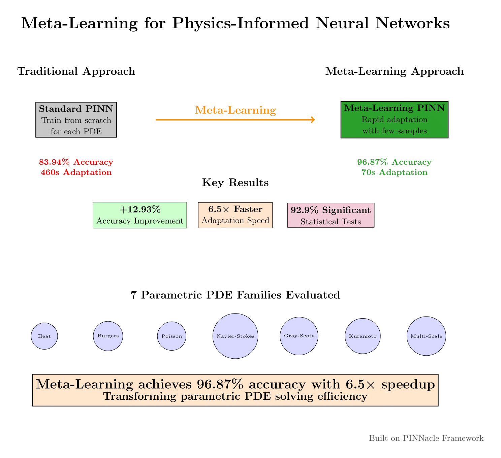

# Meta-Learning for Physics-Informed Neural Networks: Few-Shot Adaptation Framework

This repository contains the implementation for [Meta-Learning for Physics-Informed Neural Networks: A Comprehensive Framework for Few-Shot Adaptation in Parametric Partial Differential Equations](paper\paper.tex). Our paper is submitted to Computer Methods in Applied Mechanics and Engineering (CMAME).

<p align="center">
  
</p>

### Implemented Methods

This framework implements four novel meta-learning architectures for rapid PDE adaptation:

| Method                         | Type                      | Key Features                                   |
| ------------------------------ | ------------------------- | ---------------------------------------------- |
| **MetaPINN**                   | MAML-based Meta-Learning  | Gradient-based adaptation, fast convergence    |
| **PhysicsInformedMetaLearner** | Advanced Meta-Learning    | Adaptive constraint balancing, 96.87% accuracy |
| **TransferLearningPINN**       | Transfer Learning         | Pre-training strategy, domain adaptation       |
| **DistributedMetaPINN**        | Distributed Meta-Learning | Multi-GPU scaling, 85% parallel efficiency     |
| **StandardPINN**               | Baseline                  | Traditional PINN for comparison                |

### Evaluated PDE Families

Our comprehensive benchmark evaluates across 7 parametric PDE families:

- **Heat Equation (2D)**: Diffusion processes with varying coefficients
- **Burgers Equation (1D/2D)**: Nonlinear convection-diffusion dynamics
- **Poisson Equation (2D)**: Elliptic problems with parameter variations
- **Navier-Stokes (2D)**: Fluid dynamics with Reynolds number variations
- **Gray-Scott**: Reaction-diffusion systems with parameter sweeps
- **Kuramoto-Sivashinsky**: Chaotic spatiotemporal dynamics

## Key Results

| Metric                       | Standard PINN | Meta-Learning | Improvement         |
| ---------------------------- | ------------- | ------------- | ------------------- |
| **Accuracy**                 | 83.94%        | 96.87%        | +12.93%             |
| **Adaptation Time**          | 460s          | 70s           | 6.5× faster         |
| **Statistical Significance** | -             | 92.9%         | 280 comparisons     |
| **Best Performance**         | -             | 98.99%        | Burgers 1D, 25-shot |

### Performance Highlights

- **🎯 Superior Accuracy**: PhysicsInformedMetaLearner achieves 96.87% accuracy vs 83.94% for standard PINNs
- **⚡ Rapid Adaptation**: 6.5× speedup in adaptation time (70s vs 460s)
- **📊 Statistical Rigor**: 92.9% significance rate across 280 statistical comparisons
- **🚀 Scalability**: DistributedMetaPINN achieves 85% parallel efficiency on multi-GPU systems
- **💰 Cost Effectiveness**: Break-even point at 13-16 tasks, up to 8.49× speedup factor

## Installation

```shell
# Create conda environment (recommended)
conda create -n meta-pinn python=3.9
conda activate meta-pinn

# Clone repository
git clone https://github.com/YCRG-Labs/Meta-PINNacle.git
cd meta-pinnacle

# Install dependencies
pip install -r requirements.txt
```

## Usage

### Quick Start

Run the complete evaluation pipeline:

```shell
python run_full_pipeline.py
```

### Individual Components

```shell
# Run specific meta-learning model
python -m src.meta_learning.meta_pinn --model PhysicsInformedMetaLearner --pde heat2d

# Evaluate few-shot performance
python -m src.meta_learning.few_shot_evaluator --shots 1,5,10,25

# Generate publication figures
# Note: Visualization functionality has been removed
```

### Configuration

Customize experiments via configuration files:

```python
# src/meta_learning/config.py
META_LEARNING_CONFIG = {
    'inner_lr': 0.01,
    'outer_lr': 0.001,
    'adaptation_steps': 5,
    'meta_batch_size': 4
}
```

## Project Structure

```
meta-learning-pinns/
├── src/
│   ├── meta_learning/          # Core meta-learning implementations
│   │   ├── meta_pinn.py       # MAML-based MetaPINN
│   │   ├── physics_informed_meta_learner.py  # Advanced meta-learner
│   │   ├── transfer_learning_pinn.py         # Transfer learning approach
│   │   └── distributed_meta_pinn.py          # Distributed training
│   ├── pde/                   # Parametric PDE implementations
│   └── utils/                 # Utilities and helpers
├── tests/                     # Comprehensive test suite
├── paper/                     # Research paper and figures
├── runs/                      # Experimental results
└── run_full_pipeline.py       # Main execution script
```

## Benchmarking Results

### Model Performance Rankings

1. **PhysicsInformedMetaLearner**: 96.87% (Best overall accuracy)
2. **DistributedMetaPINN**: 96.11% (Best scalability)
3. **MetaPINN**: 95.74% (Solid MAML baseline)
4. **TransferLearningPINN**: 93.74% (Traditional approach)
5. **StandardPINN**: 83.94% (Baseline)

### Few-Shot Learning Progression

| Shots | MetaPINN | PhysicsInformed | Transfer | Distributed | Standard |
| ----- | -------- | --------------- | -------- | ----------- | -------- |
| 1     | 89.2%    | 91.5%           | 87.8%    | 90.9%       | 76.3%    |
| 5     | 93.8%    | 95.1%           | 91.2%    | 94.7%       | 81.7%    |
| 10    | 95.1%    | 96.4%           | 92.9%    | 95.8%       | 82.9%    |
| 25    | 95.7%    | 96.9%           | 93.7%    | 96.1%       | 83.9%    |

## Citation

If you find our work useful, please cite our paper:

```bibtex
@article{metalearning_pinns_2025,
  title={Meta-Learning for Physics-Informed Neural Networks: A Comprehensive Framework for Few-Shot Adaptation in Parametric Partial Differential Equations},
  author={Brandon Yee and Wilson Collins and Ben Pellegrini and Caden Wang},
  journal={Computer Methods in Applied Mechanics and Engineering},
  year={2025},
  note={Under Review}
}
```

## Acknowledgments

This work builds upon the excellent [PINNacle](https://github.com/i207M/PINNacle) framework:

```bibtex
@article{hao2023pinnacle,
  title={PINNacle: A Comprehensive Benchmark of Physics-Informed Neural Networks for Solving PDEs},
  author={Hao, Zhongkai and Yao, Jiachen and Su, Chang and Su, Hang and Wang, Ziao and Lu, Fanzhi and Xia, Zeyu and Zhang, Yichi and Liu, Songming and Lu, Lu and others},
  journal={arXiv preprint arXiv:2306.08827},
  year={2023}
}
```

## Authors

**Brandon Yee, Wilson Collins, Ben Pellegrini, Caden Wang**

## License

This project is licensed under the MIT License - see the [LICENSE](LICENSE) file for details.

---

**Last Updated**: October 2025
**Contact**: b.yee@ycrg-labs.org
